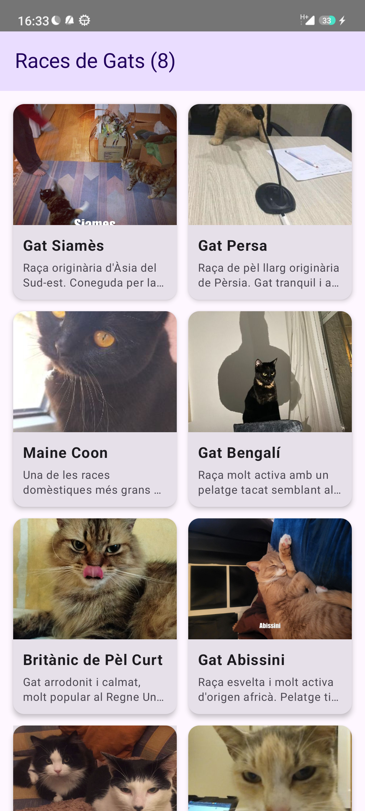
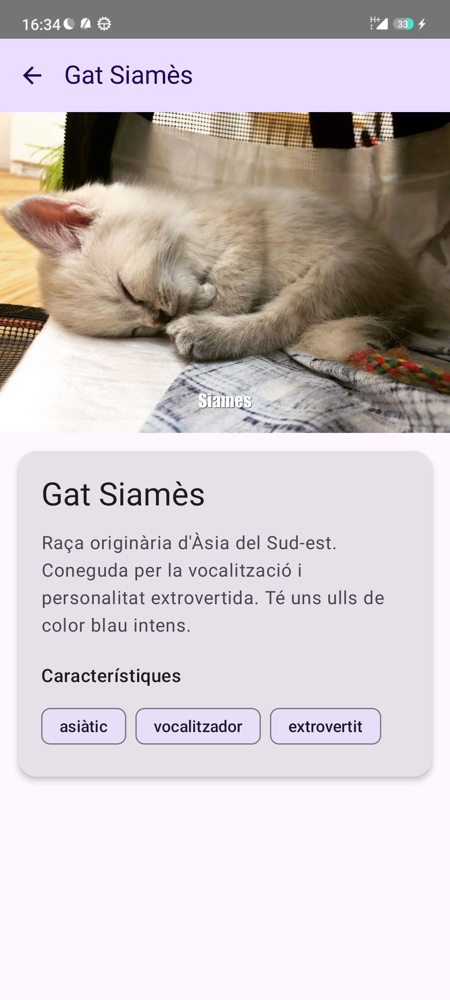

# PR06 - LazyComponents: Races de Gats 

App que mostra un catàleg de races de gats usant MVVM, LiveData i Lazy Components.

## Pantalles

### Llista de races

Graella de 2 columnes amb les 8 races de gats. Cada targeta mostra la imatge, el nom i una breu descripció. En fer clic naveguem al detall.

### Detall d'una raça

Mostra la imatge gran, el nom, la descripció completa i les característiques en forma de chips. El botó enrere del TopAppBar torna a la llista.

